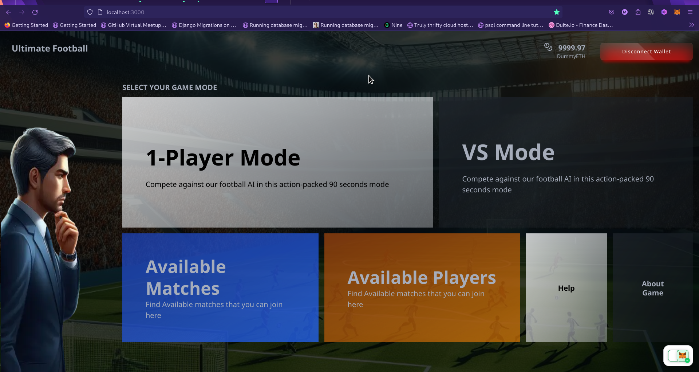
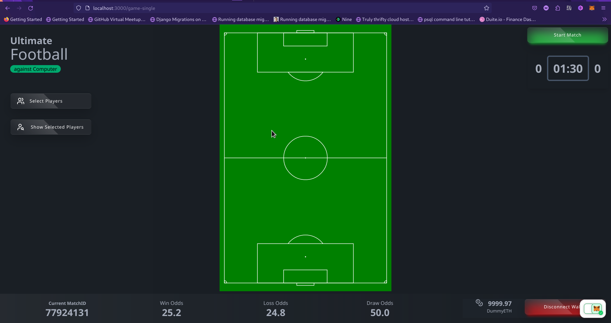
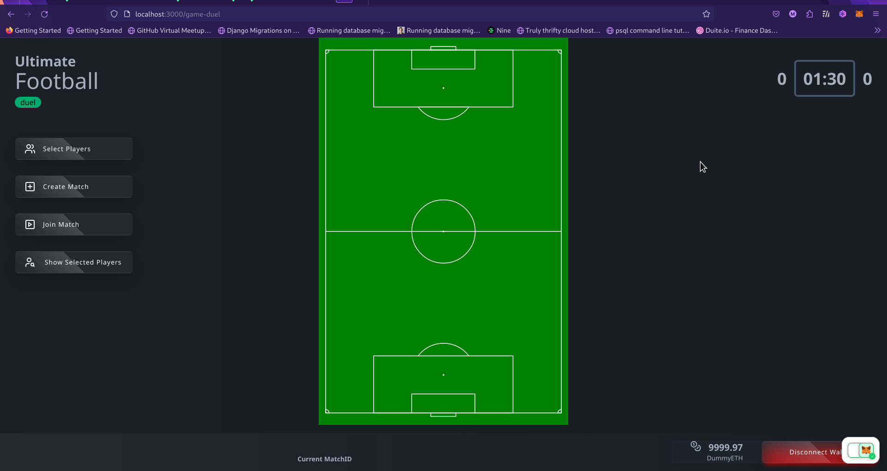
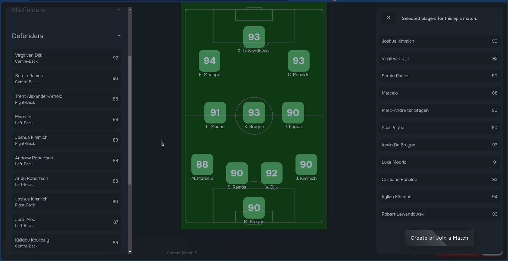

# ULTIMATE FOOTBALL BUILT ON CARTESI

## GAME COMPONENTS AND GAME PLAY

Ultimate football front-end is divided into 2 main components.

1. `Single Player Mode` - the single player mode. i.e., the game mode played against the computer.
2. `VS Player Mode (Dual Player Mode)` - Contains the code that powers the dual game mode, i.e., the game mode played against other players.

### SINGLE-MATCH MODE (AGAINST COMPUTER)

This mode is the fastest way to test out Ultimate football. In the home page, click on the `1-Player Mode` card to enter the single-player game mode.
In this mode, you can choose your players and battle against the computer. Here are the steps to follow.

1. **Select players for your match:** This is a pre-requisite to playing any game in Ultimate Football. This is because there can be no match without players.
2. **Register your Players:** Once you have selected your players, you need to register your players for the match you are about to start. Registering your players is done to run the simulation of the match before the actual match. When you register your players, certain computational data is returned. The most important ones are the:
    - win odd of the match
    - loss odd of the match
    - draw odd of the match
    - team strength average to determine the team movement and speed
    The data returned are based on simulation, the actual result of the match may vary just like in a physical football match.
3. **GamePlay**: Once player registration is complete, the match is set to begin. The match runs for 90 secs and the match runs based on the statistics from the cartesi dapp when the player-registration simulation was done. The match will run automatically for 90 secs and the match status is displayed as either `win`, `loss` or `draw` once the game ends.
4. **GameOver**: The game ends when the time reaches 0. A result modal pops-up when the game play is over.

### DUEL-MATCH MODE (AGAINST OTHER PLAYERS)

The duel player mode works similar to the single-match mode but with extra features. You also need to select players before you can perform any action in the duel-match mode. Once players have been selected, the following options are available:

1. **Create Match**: Players can create a match that other players can join. This generates an ID that can be used to join the match by other players. Creating a match perform similar action to registering your players as in the single-match mode. You have to select your players, and then you have to register those players at the point of creating a match. This action also performs the simulation of the match which eventually determines certain parameters of the gameplay.
2. **Join Match**: You can pass in an ID of a match here and join that match if the ID is valid. The logic to joining a match is that: once the matchID is a valid one and is still a pending match, the player joining the match kickstart the match. And once the gameplay is complete, similar to the single-match mode, the status of the match is displayed, and the amount staked is transferred to the winner of the game. If the game is drawn, the staked amount is shared among the players.

### LIST PLAYERS

You can see the list of available players available in the game. The reason for this is that you can make predetermined decision about which players will form your team for you battle against opponents.

### SCREENSHOTS OF ULTIMATE FOOTBALL

### CURRENT PROGRESS

This project is a work in progress.
